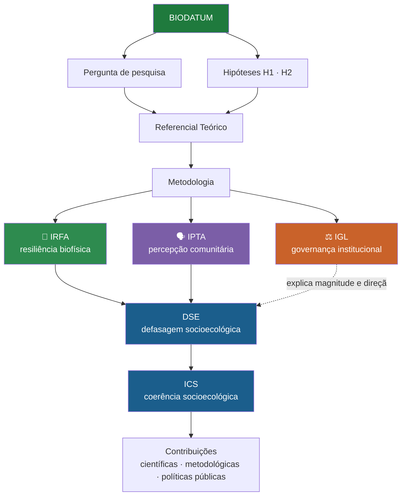

<div align="center">


<a href="https://scasttro7.github.io/Biodatum/"></a>


<br/>


</div>

<br/>

> ☕ *Construído com café, floresta e uma quantidade honestamente preocupante de campos `SEQ` do Word debugados na madrugada.*

---

## 📖 Índice

- [O que é o BIODATUM](#-o-que-é-o-biodatum)
- [Como o framework funciona](#-como-o-framework-funciona)
- [Territórios de estudo](#-territórios-de-estudo)
- [Painéis](#-painéis)
- [Estrutura do repositório](#️-estrutura-do-repositório)
- [Rodando localmente](#-rodando-localmente)
- [Citação](#-citação)
- [Contato](#-contato)

---

## 🔎 O que é o BIODATUM

O **BIODATUM** é o framework central da tese de doutorado *"O que a floresta guarda? Resiliência, percepção e governança em Reservas de Desenvolvimento Sustentável do Amazonas"* — PPGCASA/UFAM.

A ideia central: **percepção comunitária** e **resiliência biofísica** não são tratadas como pano de fundo qualitativo uma da outra — são duas fontes de evidência de **mesmo estatuto analítico** sobre um sistema socioecológico, colocadas em relação formal.

<div align="center">



</div>

---

## 🧮 Como o framework funciona

| Índice | O que mede | Fonte de dado |
|---|---|---|
| 🌳 **IRFA** — Índice de Resiliência Florestal Amazônica | Biomassa, carbono e perturbações florestais | Sensoriamento remoto (GEDI · PRODES · MapBiomas) |
| 🗣️ **IPTA** — Índice de Percepção Territorial Amazônica | Percepção comunitária dos serviços ecossistêmicos | Questionário de campo (protocolo UKRI-Brazil) |
| ⚖️ **IGL** — Índice de Governança Legal | Atributos jurídico-institucionais do território | Documentação institucional (SEMA-AM · CNUC/MMA) |
| 📐 **DSE / ICS** | Defasagem e coerência entre resiliência e percepção | IRFA × IPTA, moderado pelo IGL |

<details>
<summary><b>Ver as fórmulas</b></summary>
<br/>

```
IPTA = [(SP + SR + CEL + PMA) / 4] × (0,5 + 0,5 × VT)

IGL  = [(G + C) / 2] × (0,5 + 0,5 × J)

DSE  = IPTA − IGL
ICS  = 1 − |DSE|
```

`DSE` positivo → **otimismo desacoplado** (percepção maior que governança formal)
`DSE` negativo → **resiliência desacoplada** (governança maior que percepção)

</details>

---

## 🗺️ Territórios de estudo

| Território | RDS | Município/AM | Status |
|---|---|---|---|
| **T1** | Puranga Conquista | Manaus | ✅ Campo concluído — 33 questionários |
| **T2** | Rio Madeira | Novo Aripuanã | ⏳ Campo ainda não realizado |

---

## 📊 Painéis

<table>
<tr>
<td width="50%" valign="top">

### 🌐 Visão geral pública
Experiência imersiva do framework: mapa dos três territórios, dados do Higuchi, GEDI/LiDAR, linha do tempo *"Floresta Ancestral"*.

**[→ scasttro7.github.io/Biodatum](https://scasttro7.github.io/Biodatum/)**

</td>
<td width="50%" valign="top">

### 📈 Painel T1 — Puranga Conquista
Acompanhamento técnico: IPTA, IGL, DSE/ICS por pessoa e comunidade, caracterização territorial, casos de campo.

**[→ Dashboard_BIODATUM_T1.html](https://scasttro7.github.io/Biodatum/Dashboard_BIODATUM_T1.html)**

</td>
</tr>
</table>

> ⚠️ O Painel T1 mostra **resultados preliminares de qualificação**, incluindo um codebook documental (J) ainda não validado pela orientação. Não deve ser lido como resultado final da tese.

---

## 🗂️ Estrutura do repositório

```
Biodatum/
├── 📄 index.html                   # Painel público imersivo
├── 📄 Dashboard_BIODATUM_T1.html   # Painel técnico de acompanhamento (T1)
├── 🐍 App.py                       # Protótipo Streamlit
├── 📓 BIODATUM_Prototipo.ipynb     # Notebook de prototipagem
├── 📓 BIODATUM_dev.ipynb           # Notebook de desenvolvimento
└── 📋 Requisitos.txt               # Dependências Python
```

---

## 🚀 Rodando localmente

```bash
git clone https://github.com/scasttro7/Biodatum.git
cd Biodatum
pip install -r Requisitos.txt
streamlit run App.py
```

---

## 📚 Citação

Se este framework for útil para sua pesquisa, cite:

```bibtex
@phdthesis{silva_biodatum,
  author  = {Silva, Sabrina Castro da},
  title   = {O que a floresta guarda? Resiliência, percepção e governança
             em Reservas de Desenvolvimento Sustentável do Amazonas},
  school  = {Universidade Federal do Amazonas (PPGCASA)},
  address = {Manaus, Brasil},
  note    = {Tese em desenvolvimento}
}
```

---

## ✉️ Contato

<div align="center">

**Sabrina Castro da Silva** — PPGCASA/UFAM
Orientação: Profª. Drª. Francimara Souza da Costa


</div>

<br/>


